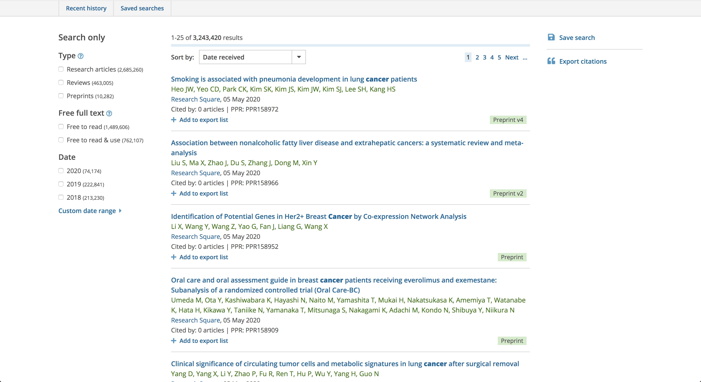

# text-annotator
A JavaScript library for locating and annotating plain text in HTML

## Examples
text-annotator has been widely used in [Europe PMC](https://europepmc.org "Europe PMC"), an open science platform that enables access to a worldwide collection of life science publications. Here is a list of examples:
1. Article title highlighting: https://europepmc.org/search?query=cancer

2. Snippets: https://europepmc.org/article/PPR/PPR158972 (Visit from https://europepmc.org/search?query=cancer)

3. SciLite: https://europepmc.org/article/PPR/PPR158972 (Click the Annotations link in the right panel)

4. Linkback: https://europepmc.org/article/PPR/PPR158957#europepmc-85a627f3ccf1d524b850dd149add4605

## Contact
[Zhan Huang](mailto:z2hm@outlook.com "Zhan Huang")
